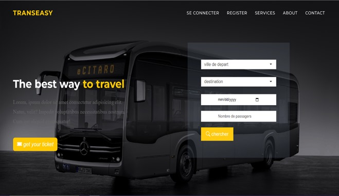
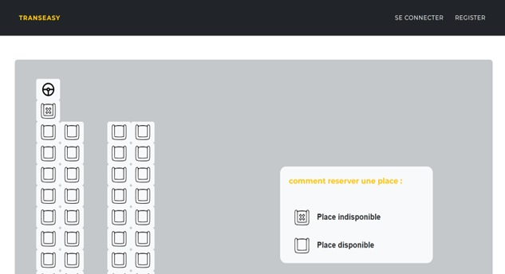
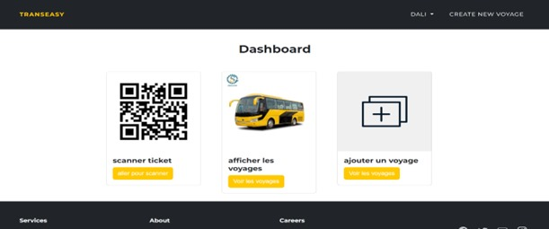
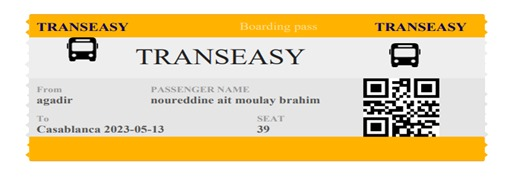

# TRANSEASY - Transport Agency Management System

**TRANSEASY** is a comprehensive web application designed to digitize and streamline the management of public transport agencies. Developed as a final year project (PFE), this system facilitates operations for administrators while providing a seamless booking experience for passengers.

## 📝 About The Project

The traditional methods of managing transport reservations often lead to inefficiencies, double bookings, and a lack of real-time information. **TRANSEASY** solves these problems by automating the reservation process and centralizing data.

**Key Objectives:**
* Simplify the ticket reservation process for passengers.
* Provide real-time management of buses, trips, and seats for administrators.
* Secure data and transactions.
* Generate digital tickets with QR Codes for easy validation.

## 🚀 Features

### 👨‍💼 For Administrators
* **Dashboard:** Overview of financial statistics and travel status.
* **Trip Management:** Create, modify, and delete travel routes (CRUD).
* **Booking Oversight:** View booked seats and passenger lists.
* **Ticket Validation:** Integrated QR Code scanner to validate passenger tickets via camera.
* **Financials:** Monitor revenue per trip.

### 🚌 For Passengers
* **Search Engine:** Find trips by departure city, destination, and date.
* **Seat Selection:** Interactive visual map to choose available seats.
* **Booking & Payment:** Secure checkout process for ticket purchase.
* **Digital Tickets:** Download tickets in PDF format containing a unique QR Code.

## 🛠️ Technology Stack

This project follows the **MVC (Model-View-Controller)** architecture and the **2 Track-Unified-Process** methodology.

* **Backend Framework:** Laravel (PHP)
* **Frontend:** HTML5, CSS3, Bootstrap, JavaScript (jQuery)
* **Database:** MySQL
* **Tools:** Visual Studio Code, XAMPP, GanttProject, StarUML

## 📸 Screenshots

### Homepage & Search

*User-friendly interface for searching bus trips.*

### Seat Selection

*Interactive seat map for passengers.*

### Admin Dashboard & Statistics

*Financial statistics and trip management overview.*

### QR Code Ticket Validation

*these are the tickets that can the admin scan to validate.*


## ⚙️ Installation & Setup

To run this project locally, you will need **PHP**, **Composer**, and **MySQL** installed.

1.  **Clone the repository**
    ```bash
    git clone [https://github.com/nordinamb/TRANSEASY.git](https://github.com/nordinamb/TRANSEASY.git)
    cd TRANSEASY
    ```

2.  **Install Dependencies**
    ```bash
    composer install
    npm install
    ```

3.  **Environment Configuration**
    * Rename `.env.example` to `.env`.
    * Update your database credentials (DB_DATABASE, DB_USERNAME, DB_PASSWORD).

4.  **Generate Application Key**
    ```bash
    php artisan key:generate
    ```

5.  **Run Migrations**
    ```bash
    php artisan migrate
    ```

6.  **Run the Application**
    ```bash
    php artisan serve
    ```
    Visit `http://localhost:8000` in your browser.

## 👥 Author

* **Noureddine Ait Moulay Brahim**

*Supervised by: Pr. Fatima Azzahra AMAZAL*

## 🎓 Context

**Université Ibn Zohr - Faculté des Sciences d'Agadir**
*Department of Computer Science*
*Filière Sciences Mathématiques et Informatique (SMI)*
*Année universitaire: 2022-2023*

---